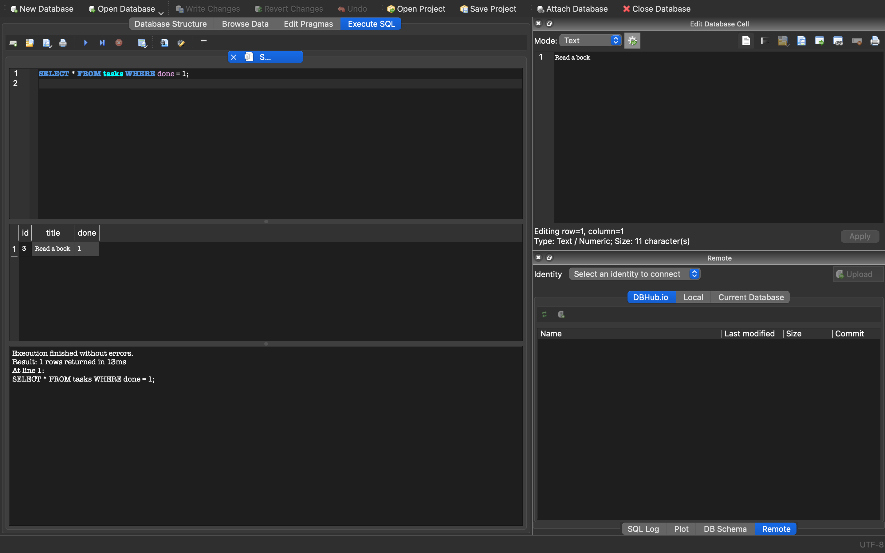
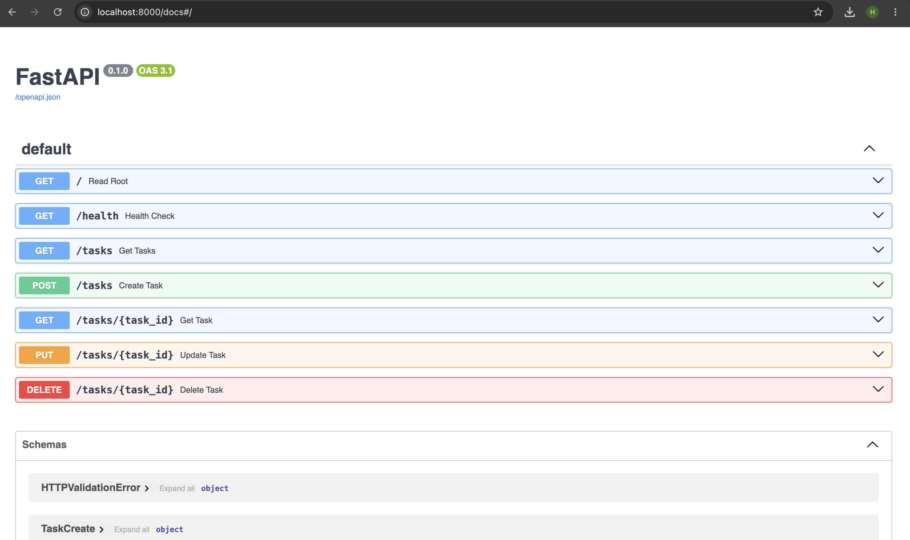

# Task API — CRUD To-Do List (now backed by SQLite)

A CRUD API built with **Python + FastAPI** for FlyRank Internship — Backend Track, Week 3, Assignment A2.

This is the direct sequel to Assignment 1: the same five endpoints, the same request/response
shapes — but tasks are now stored in a real **SQLite** database (`tasks.db`) instead of an
in-memory Python list. Data now survives a server restart.

## Why SQLite

SQLite was chosen because it needs **no separate server and no install of its own** — the entire
database is a single file (`tasks.db`), created automatically the first time the app runs. That
makes it the natural next step up from an in-memory list: zero setup, and your data now survives
restarts. For a larger, multi-user production app you'd eventually reach for something like
Postgres, but for a single-service to-do API, SQLite is the right amount of database.

## Where the database file lives

`tasks.db` sits in the project root, next to `main.py`. It is created automatically on first
run and is **git-ignored** (see `.gitignore`) — every fresh clone starts with a clean database
that gets seeded on its first startup, not with someone else's data.

## How to run it

1. Clone the repo:
   ```bash
   git clone https://github.com/Haris-Mahmood-21/todo-api.git
   cd todo-api
   ```

2. Create and activate a virtual environment:
   ```bash
   python3 -m venv venv
   source venv/bin/activate   # Mac/Linux
   venv\Scripts\activate      # Windows
   ```

3. Install dependencies:
   ```bash
   pip install -r requirements.txt
   ```

4. Run the server (this single command is all a fresh clone needs — `tasks.db`, the `tasks`
   table, and the 3 seed tasks are all created automatically):
   ```bash
   uvicorn main:app --reload
   ```

5. Visit:
   - API root: http://localhost:8000/
   - Swagger UI (interactive docs): http://localhost:8000/docs

## Endpoints

| Method | Path              | Description                          | Success | Errors             |
|--------|-------------------|---------------------------------------|---------|---------------------|
| GET    | `/`               | API info                              | 200     | —                   |
| GET    | `/health`         | Health check                          | 200     | —                   |
| GET    | `/tasks`          | List all tasks (read from SQLite)     | 200     | —                   |
| GET    | `/tasks/{id}`     | Get a single task                     | 200     | 404 if not found    |
| POST   | `/tasks`          | Create a new task (INSERT)            | 201     | 400 if title missing/empty |
| PUT    | `/tasks/{id}`     | Update a task's title and done status (UPDATE) | 200 | 400 invalid body, 404 not found |
| DELETE | `/tasks/{id}`     | Delete a task (DELETE)                | 204     | 404 if not found    |

All queries use **parameterized placeholders** (`?`) — no user input is ever glued directly
into a SQL string.

## Example request

```bash
curl -i -X POST http://localhost:8000/tasks \
  -H "Content-Type: application/json" \
  -d '{"title":"Buy milk"}'
```

```
HTTP/1.1 201 Created
content-type: application/json

{"id":4,"title":"Buy milk","done":false}
```

## Proving persistence

```bash
curl -X POST http://localhost:8000/tasks -H "Content-Type: application/json" -d '{"title":"Learn SQLite"}'
# stop the server (Ctrl+C), start it again with: uvicorn main:app --reload
curl http://localhost:8000/tasks
# "Learn SQLite" is still there — this is the whole point of a database.
```

Restarting the server three times in a row still shows exactly 3 seeded tasks (not 6, not 9) —
the seed only runs when the table is empty.

## Stage 4 — exploring the database by hand

Opened `tasks.db` in **DB Browser for SQLite** and ran these queries in the "Execute SQL" tab:

```sql
SELECT * FROM tasks WHERE done = 1;
```
Returned exactly one row — `Read a book` — the only seeded task marked complete. Calling
`GET /tasks` from the running API immediately reflected any change made this way, with no
restart needed, because the API and DB Browser are reading the exact same file.

Screenshot of the database open in DB Browser:



## Swagger UI

Screenshot of the interactive docs at `/docs`:



## Data storage note

Tasks are stored in a SQLite database file, `tasks.db`, using Python's built-in `sqlite3`
module. The `tasks` table is created automatically if missing, and 3 example tasks are seeded
only when the table is empty (checked with `SELECT COUNT(*)` before inserting, and the seed
insert itself runs inside a transaction so all 3 rows commit together or not at all).

An index (`idx_tasks_title`) was added on the `title` column since future search/sort features
would filter or order on it — an index lets SQLite look up matching rows without scanning the
whole table.

Proof that only the storage layer changed: the same `curl` commands from Assignment 1 (same
paths, same status codes, same JSON shapes) pass unchanged against this SQLite version. That's
the point of separating the API from its storage — clients never notice the swap.

## AI vs me

*(To fill in after completing Stage 6 — the AI rematch: your own prompt, what the AI's
version got right/wrong, and what your prompt left the AI to decide on its own.)*