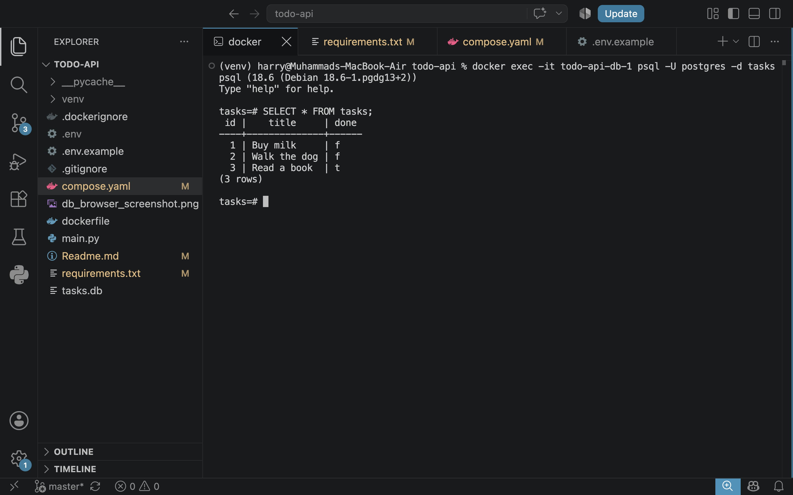

# Task API — CRUD To-Do List (now containerized with Postgres)

A CRUD API built with **Python + FastAPI** for FlyRank Internship — Backend Track, Week 1, Assignment A3.

> **Note:** This repo has grown across three assignments in the same lane: storage went from an
> in-memory list (A1) to a SQLite file (A2) to a containerized PostgreSQL database (A3, this one).
> The routes and request/response shapes have stayed identical the whole way — only the storage
> layer underneath changed each time.

The whole stack — the API and its Postgres database — now starts with a single command:

```bash
docker compose up
```

## Why Postgres in Docker

Postgres is a real database server, the same engine behind a large share of production backends.
Running it in Docker means nobody has to install Postgres or fight version mismatches — the
official `postgres` image behaves identically on every machine. A named **volume**
(`taskdata`) keeps the actual rows on disk outside the container, so `docker compose down`
followed by `docker compose up` brings the stack back with all the data still there.

## Secrets

The database connection string is never hardcoded. It's read from a `DATABASE_URL` environment
variable:

- `.env` — your real local values, **git-ignored**, never committed.
- `.env.example` — the same keys with placeholder values, committed so anyone cloning the repo
  knows what to set.

## How to run it

**Requires:** [Docker Desktop](https://www.docker.com/products/docker-desktop/) (free) installed and running.

1. Clone the repo:
   ```bash
   git clone https://github.com/Haris-Mahmood-21/todo-api.git
   cd todo-api
   ```

2. Copy the example env file:
   ```bash
   cp .env.example .env
   ```

3. Start the whole stack (API + Postgres) with one command:
   ```bash
   docker compose up
   ```

4. Visit:
   - API root: http://localhost:8000/
   - Swagger UI: http://localhost:8000/docs

That's it — no manual Postgres install, no manual table creation. The `tasks` table and 3 seed
tasks are created automatically the first time the `api` service starts.

## Endpoints

| Method | Path           | Description                                    | Success | Errors                      |
|--------|----------------|-------------------------------------------------|---------|-------------------------------|
| GET    | `/`            | API info                                        | 200     | —                              |
| GET    | `/health`      | Health check — also runs `SELECT 1` against the DB | 200  | 503 if DB unreachable          |
| GET    | `/tasks`       | List all tasks                                  | 200     | —                              |
| GET    | `/tasks/{id}`  | Get a single task                               | 200     | 404 if not found               |
| POST   | `/tasks`       | Create a task (`INSERT ... RETURNING *`)        | 201     | 400 if title missing/empty     |
| PUT    | `/tasks/{id}`  | Update a task's title/done status               | 200     | 400 invalid body, 404 not found |
| DELETE | `/tasks/{id}`  | Delete a task                                   | 204     | 404 if not found               |

All queries use **parameterized placeholders** (`%s`, via `psycopg`) — no user input is ever
glued into a SQL string.

## Example request

```bash
curl -i -X POST http://localhost:8000/tasks \
  -H "Content-Type: application/json" \
  -d '{"title":"Buy milk"}'
```

```
HTTP/1.1 201 Created
content-type: application/json

{"id":4,"title":"Buy milk","done":false}
```

## Proving persistence across a full-stack restart

```bash
curl -X POST http://localhost:8000/tasks -H "Content-Type: application/json" -d '{"title":"Learn Docker"}'
docker compose down
docker compose up
curl http://localhost:8000/tasks
# "Learn Docker" is still there — the volume kept it, even after the containers were torn down.
```

## Screenshot of the data in Postgres

Ran this inside the running `db` container to confirm the rows:

```bash
docker exec -it todo-api-db-1 psql -U postgres -d tasks -c "SELECT * FROM tasks;"
```



## Data storage note

Tasks are stored in a PostgreSQL database running as its own container, using the `psycopg`
driver. The `tasks` table (`id SERIAL PRIMARY KEY, title TEXT, done BOOLEAN`) is created
automatically if missing, and 3 example tasks are seeded only when the table is empty — the
same first-run rule used in A2. An index (`idx_tasks_done`) was added on the `done` column since
that's the most likely filter column for a future "show only completed tasks" feature.

`GET /health` doubles as a real health check: it runs `SELECT 1` against the database, not just
returning `200 OK` blindly. A load balancer in production would use an endpoint like this to
decide whether to keep routing traffic to an instance, or pull it out of rotation if its
database connection has failed.

Proof that only the storage layer changed across all three assignments: the exact same `curl`
commands from A1 and A2 (same paths, same status codes, same JSON shapes) pass unchanged against
this Postgres version. That's the point of keeping the database logic in one module (the
"repository") separate from the routes — the API is a promise, and the database is just where
that promise is currently being kept.

## AI vs me

*(To fill in after completing Stage 6 — the AI rematch: your own prompt, what the AI's
containerized version got right/wrong, and what your prompt left the AI to decide on its own.)*